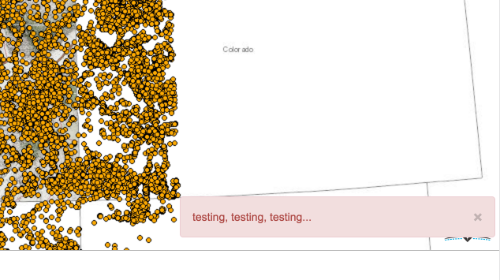

# Toaster

Easily toast messages to your app using a dynamically placed bootstrap alert.

Example
```javascript
var toaster = new Toaster({
    topic: 'toast-topic'
});
toaster.startup();

topic.publish('toast-topic', 'hello world');
```


